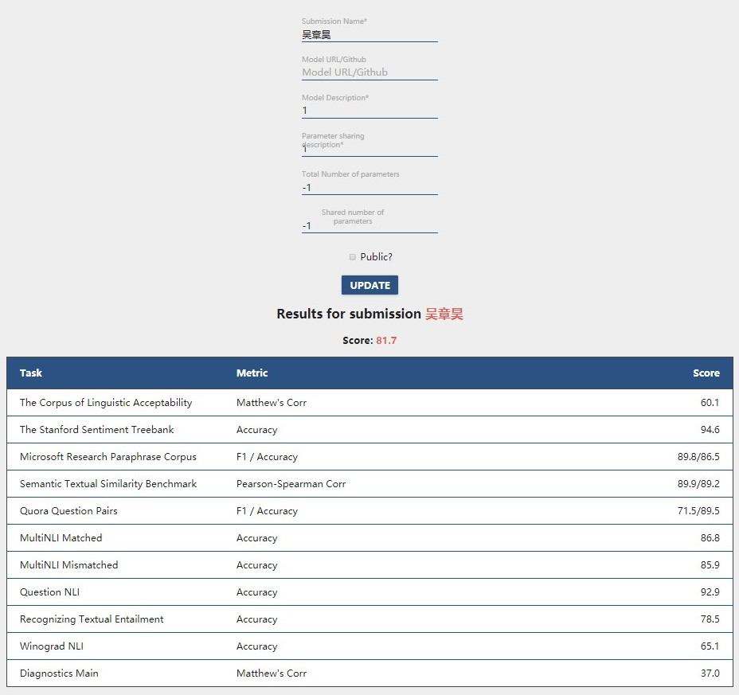

# GLUE Benchmark (STS-B and CoLA)

This is a readme file for the course project of *Natural Language Processing*, CS229, by Prof. Hai Zhao.

* **Author:** Zhanghao Wu (516030910593)
* **Email:** wz.wzh@sjtu.edu.cn
* **Affiliation:** ACM Honored Class, Zhiyuan College, SJTU

I will introduce the two models I used for this task, including BERT[1] and MT-DNN[2]. And I will then showing how to run the codes. Also the result on the public GLUE benchmark is shown in the appendix at the bottom.

## Models
### Pretrained BERT

BERT[1] is a language representation model proposed by Devlin *et al.* from *Google inc*. BERT takes advantages of attention mechanism with unsupervised (or natural supervised as mentioned by Prof. Zhao) training on very large unlabeled datasets, like wikipedia.

With the codebase from [huggingface/pytorch-pretrained-BERT](https://github.com/huggingface/pytorch-pretrained-BERT.git), I rewrite the finetuning process, making the program automatically finding the best epoch on dev set when training and output the test results with the best model and the ensemble result with the model got from 3 epochs near the best epoch.

For this part, I tried both the cased model and the uncased model. It turns out that the cased model has a degradation on performance, which may caused by lacking of enough training data, since the cased model should *see* more examples to learn the task.

### MT-DNN

I also tried a improved version of BERT, called MT-DNN[2] proposed by Liu *et al.* from the *Microsoft Inc*. The model used multi-task for learning representation across multiple natural language understanding (NLU) tasks with BERT as the backbone. The basic idea for this architecture is that multi-task helps the BERT to adapt to certain target domain.

With the codebase from [namisan/mt-dnn](https://github.com/namisan/mt-dnn.git), I got a better results on both STS-B and CoLA tasks. The reason for the improvement relies on that the MT-DNN can learn from the correlation between different tasks, like sharing some information between CoLA and SST-2.

The MT-DNN model improve the Pearson/Spearman Correlation from 87.1/86.0 to 89.9/89.2 and the Matthew Correlation on CoLA from 57.3 to 60.1 on test set. By ensemble the MT-DNN with the single-task finetuned BERT, I got a further better result on STS-B, 89.9/89.2. The results are shown in the table below.

## Results
| STS-B (model) | Pearson/Spearman Correlation |
|:--------|:------:|
| Bert-large-cased                              |  85.9/84.8  |
| Bert-large-uncased                            |  87.1/86.0  |
| ensemble cased and uncased                    |  87.4/86.3  |
| **MT-DNN**                                    |  89.4/88.6  |
| **ensemble MT-DNN with BERT**                 |  **89.9/89.2**  |

| CoLA (modle) | Matthew Correlation |
|:---|:---:|
| BERT-large-uncased                             |  57.3       |
| **MT-DNN**                                     |  **60.1**   |


## Get Started
To run the code more conveniently, I wrote some shell scripts for installation, training and testing. The steps to use install the environment, training the model and testing are shown below.
### Prerequisite
1. BERT
   ```bash
   cd ./pytorch-pretrained-BERT
   pip install -r requirements.txt
   pip install --editable .
   python ./download_glue_data.py
   ```
2. MT-DNN
   ```bash
   cd ./mt-dnn
   pip install -r requrirements.txt
   ./download.sh
   python ./preproc.py
   ```

### Training
1. BERT
   ```bash
   cd ./pytorch-pretrained-BERT
   # Finetune pretrained BERT for STS-B
   ./run_stsb.sh
   # Finteune pretrained BERT for CoLA
   ./run_cola.sh
   ```
2. MT-DNN
   ```bash
   cd ./mt-dnn/scripts
   # Train MT-DNN model (not necessary using the pretrained one)
   ./run_mt_dnn.sh
   # Finetune pretrained MT-DNN for STS-B
   ./run_stsb.sh 32 0,1,2,3
   # Finetune pretrained MT-DNN for CoLA
   ./run_cola.sh 32 0,1,2,3
   ```
   
### Testing
1. BERT
   ```bash
   cd ./pytorch-pretrained-BERT
   # Test STS-B with the my pretrained checkpoint
   ./tes_stsb.sh
   # Test CoLA with the my pretrained checkpoint
   ./tes_cola.sh
   ```
2. MT-DNN
   ```bash
   cd ./mt-dnn/scripts
   # Test STS-B with the my pretrained checkpoint
   ./tes_stsb.sh 32 0,1,2,3
   # Test CoLA with the my pretrained checkpoint
   ./tes_cola.sh 32 0,1,2,3
   ```
## Reference
[1] Devlin, J., Chang, M. W., Lee, K., & Toutanova, K. (2018). BERT: Pre-training of deep bidirectional transformers for language understanding. arXiv preprint arXiv:1810.04805.
 
[2] Liu, X., He, P., Chen, W., & Gao, J. (2019). Multi-Task Deep Neural Networks for Natural Language Understanding. arXiv preprint arXiv:1901.11504.

## Appendix
